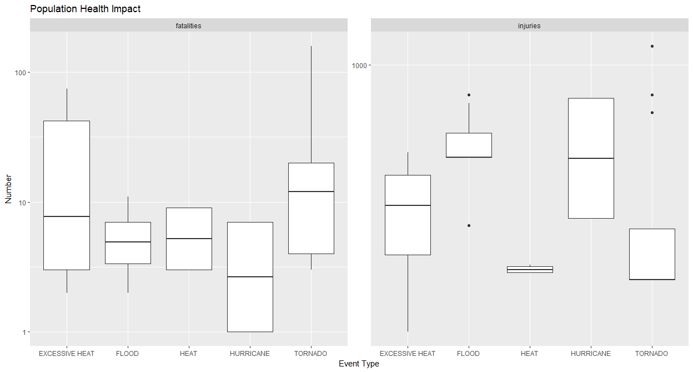
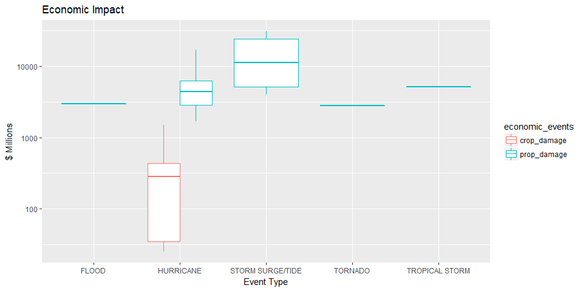

# Human & Economic Impacts of Major Storms: 1996-2011
Mark Blackmore  
August 8, 2017  


# Synopsis
This report explores the NOAA Storm Database in the interest of answering two basic questions:  

1. Across the United States, which types of events are most harmful with respect to population health? 
2. Across the United States, which types of events have the greatest economic consequences?

The report focuses on total event risk, defined as those storm event types that have had over two-hundred-one injuries plus fatalities over time, and over $2 Billion in economic damages over time.

The report finds that event type Tornado has the largest "headline risk" in terms of the largest number of injuries and fatalities in an event.  Tornado also has the highest level of median fatalities, while Hurricane has the highest level of median injuries.  

The report finds that Storm Surge/Tide and Hurricane has the largest "headline risk" in terms of the largest absolute economic damages in an event. Storm Surge/Tide damages dominate all others due to the significance of Katrina which had a Storm Surge/Tide event along with the Hurricane.  Storm Surge/Tide also has the highest median property damage.

# Data Processing

```r
library(tidyverse)
```

## Data: Source url, Codebook, Forum Notes, Download, Import  
Storm data were read from the NOAA source url to the local level and read into R for processing.  Also listed are url's for the NOAA database codebook, and  the Coursera Reproducible Reasearch Forum on how to handle economic damage variables.


```r
### NOAA Database 
url <- "https://d396qusza40orc.cloudfront.net/repdata%2Fdata%2FStormData.csv.bz2"

### Codebook
codebook_url <- "https://d396qusza40orc.cloudfront.net/repdata%2Fpeer2_doc%2Fpd01016005curr.pdf"

### Forum Notes on Handling PROPDMGEXP, CROPDMGWXP Variables
forum_url <- "https://www.coursera.org/learn/reproducible-research/discussions/weeks/4/threads/IdtP_JHzEeaePQ71AQUtYw"

exp_vars_url <- "https://rstudio-pubs-static.s3.amazonaws.com/58957_37b6723ee52b455990e149edde45e5b6.html"

### Download data and Import
if (!file.exists("data")) {
  dir.create("data")
}
download.file(url, destfile = "./data/StormData.csv")
stormData <- read.csv("./data/StormData.csv", stringsAsFactors = FALSE)
```

## Initial Processing Steps
The original data was treated as read-only. Processing occured in steps, beginning with a copy of the source data. Date variables were coerced to class-date.  

The entire data set begins in 1950 but initally only included the event type tornado. More event types were added over time. From 1996 on, all event types were used. Hence, we subsetted the data to events occurring on or after January 1, 1996.

The storm data type variable "EVTYPE" and exponent variables were coerced to class factor for processing and to aid in investigation. 


```r
### Treat downloaded data as read-only
stormData1 <- stormData

## Change event begin date varaiable class from character to date
stormData1$BGN_DATE <- as.Date(stormData$BGN_DATE, format = "%m/%d/%Y")

## Subset to years 1996 - 2011
stormData2 <- stormData1 %>% filter(BGN_DATE >= "1996-01-01")

## Change event type variable from character to factor for further investigation
stormData2$EVTYPE   <- factor(stormData2$EVTYPE)
stormData2$PROPDMGEXP   <- factor(stormData2$PROPDMGEXP)  
stormData2$CROPDMGEXP   <- factor(stormData2$CROPDMGEXP)
```

## Rename Important Event Types to Conform to Codebook  
Several event types were renamed to conform with the NOAA Event Type classification table.  This reclassification also focused on major events and did not handle every instance, only those thought to have a major impact on this analysis.


```r
stormData2$EVTYPE[stormData2$EVTYPE=="HURRICANE/TYPHOON"] <- "HURRICANE"
stormData2$EVTYPE[stormData2$EVTYPE=="TYPHOON"] <- "HURRICANE"
stormData2$EVTYPE[stormData2$EVTYPE=="STORM SURGE"] <- "STORM SURGE/TIDE"
stormData2$EVTYPE[stormData2$EVTYPE=="TSTM WIND"] <- "THUNDERSTORM WIND"
stormData2$EVTYPE[stormData2$EVTYPE=="TSTM WIND/HAIL"] <- "THUNDERSTORM WIND"
stormData2$EVTYPE[stormData2$EVTYPE=="MARINE TSTM WIND"] <- "MARINE THUNDERSTORM WIND"
stormData2$EVTYPE[stormData2$EVTYPE=="WILD/FOREST FIRE"] <- "WILDFIRE"
stormData2$EVTYPE[stormData2$EVTYPE=="FOG"] <- "DENSE FOG"
stormData2$EVTYPE[stormData2$EVTYPE=="URBAN/SML STREAM FLD"] <- "FLOOD"
stormData2$EVTYPE[stormData2$EVTYPE=="WINTER WEATHER/MIX"] <- "WINTER WEATHER"
stormData2$EVTYPE[stormData2$EVTYPE=="HEAVY SURF/HIGH SURF"] <- "HIGH SURF"
stormData2$EVTYPE[stormData2$EVTYPE=="TSTM WIND (G45)"] <- "THUNDERSTORM WIND"
stormData2$EVTYPE[stormData2$EVTYPE=="TSTM WIND (G40)"] <- "THUNDERSTORM WIND"
stormData2$EVTYPE[stormData2$EVTYPE=="STRONG WINDS"] <- "HIGH WIND"
stormData2$EVTYPE[stormData2$EVTYPE=="FREEZING RAIN"] <- "SLEET"
stormData2$EVTYPE[stormData2$EVTYPE=="EXTREME WINDCHILL TEMPERATURES"] <- "EXTREME COLD/WIND CHILL"
stormData2$EVTYPE[stormData2$EVTYPE=="COLD/WIND CHILL"] <- "EXTREME COLD/WIND CHILL"
stormData2$EVTYPE[stormData2$EVTYPE=="EXTREME COLD"] <- "EXTREME COLD/WIND CHILL"
stormData2$EVTYPE[stormData2$EVTYPE=="EXTREME WINDCHILL"] <- "EXTREME COLD/WIND CHILL"
stormData2$EVTYPE[stormData2$EVTYPE=="COLD"] <- "EXTREME COLD/WIND CHILL"
stormData2$EVTYPE[stormData2$EVTYPE=="RECORD COLD"] <- "EXTREME COLD/WIND CHILL"
stormData2$EVTYPE[stormData2$EVTYPE=="UNSEASONABLY COLD"] <- "EXTREME COLD/WIND CHILL"
stormData2$EVTYPE[stormData2$EVTYPE=="Cold"] <- "EXTREME COLD/WIND CHILL"
stormData2$EVTYPE[stormData2$EVTYPE=="UNUSUALLY COLD"] <- "EXTREME COLD/WIND CHILL"
stormData2$EVTYPE[stormData2$EVTYPE=="SNOW"] <- "HEAVY SNOW"
stormData2$EVTYPE[stormData2$EVTYPE=="Snow"] <- "HEAVY SNOW"
stormData2$EVTYPE[stormData2$EVTYPE=="EXCESSIVE SNOW"] <- "HEAVY SNOW"
stormData2$EVTYPE[stormData2$EVTYPE=="WIND"] <- "HIGH WIND"
stormData2$EVTYPE[stormData2$EVTYPE=="Heavy Rain"] <- "HEAVY RAIN"
stormData2$EVTYPE[stormData2$EVTYPE=="RECORD RAINFALL"] <- "HEAVY RAIN"
stormData2$EVTYPE[stormData2$EVTYPE=="RECORD WARMTH"] <- "HEAT"
stormData2$EVTYPE[stormData2$EVTYPE=="UNUSUAL WARMTH"] <- "HEAT"
stormData2$EVTYPE[stormData2$EVTYPE=="RECORD HEAT"] <- "HEAT"
stormData2$EVTYPE[stormData2$EVTYPE=="UNSEASONABLY WARM"] <- "HEAT"
stormData2$EVTYPE[stormData2$EVTYPE=="Winter Weather"] <- "WINTER WEATHER"
stormData2$EVTYPE[stormData2$EVTYPE=="FREEZE"] <- "FROST/FREEZE"
stormData2$EVTYPE   <- factor(stormData2$EVTYPE)
#summary(stormData2$EVTYPE)
```

## Place Economic Variables on Common Basis; Rescale 
Variables related to property damage and crop damage caused by storm events were converted to a common dollar basis and scaled to $ millions. Further disucssion here is technical and may be skipped without losing the overall point of this analysis.

Variables for economic damage include PROPDMG for property damage, CROPDMG for crop damage, PROPDMGEXP for the power of ten exponent related to PROPDMG, and CROPDMGEXP for the power of ten exponent related to CROPDMG.  We used the discussion provided in exp_vars_url, listed above, as a guide to changing PROPDMG and CROPDMG to dollars in millions.


```r
## Mutate to common numeric/dollar basis, incorporating exponent variables
## Rescaled to Millions of Dollars ($000,000)
stormData3 <- stormData2 %>%
  mutate(prop_damage = ifelse(PROPDMGEXP == "", PROPDMG*10^-6, 
    ifelse(PROPDMGEXP == "B", PROPDMG*10^3, 
    ifelse(PROPDMGEXP == "M", PROPDMG*10^0, 
    ifelse(PROPDMGEXP == "K", PROPDMG*10^-3,
    ifelse(PROPDMGEXP ==  0,   PROPDMG*10^-5, PROPDMG)))))) %>%
  mutate(crop_damage = ifelse(CROPDMGEXP == "", CROPDMG*10^-6, 
    ifelse(CROPDMGEXP == "B", CROPDMG*10^3, 
    ifelse(CROPDMGEXP == "M", CROPDMG*10^0, 
    ifelse(CROPDMGEXP == "K", CROPDMG*10^-3,
    ifelse(CROPDMGEXP ==  0,  CROPDMG*10^-5, CROPDMG))))))
```

## Checking Outliers & Correcting Entries

```r
# Incorrect exponent - per comments
stormData3$prop_damage[stormData3$prop_damage == 1.15e+05] <- 115
# stormData3 %>% filter(crop_damage == 1.51e+03) # Katrina
# stormData3 %>% filter(prop_damage == 3.13e+04) # Katrina
```

## Create Total Impact Variables; Convert to Tidy data
We created a new variable for the total health impact of storms, calculated as the sum of injuries and fatalities by event. Similarly, we created a new variable for total economic impact, caluclated as the sum of property damage and crop damage by event. We will use these new variables to filter for largest storm event impacts.

We reshaped the data frame to the tidy data standard - one case per row, one variable per column. Our final processing step was to select only the variables needed to answer the questions posed.


```r
stormData4 <- stormData3  %>%
  mutate(total_econ  = prop_damage + crop_damage) %>%
  mutate(total_human = FATALITIES + INJURIES) %>%
  rename(fatalities = FATALITIES) %>% rename(injuries = INJURIES) %>%
  gather("human_events", "human_count", fatalities:injuries) %>%
  gather("economic_events", "dollars", prop_damage, crop_damage) %>%
  select(EVTYPE, BGN_DATE, human_events, human_count, total_human, economic_events, dollars, total_econ)
```

# Results  
## Population Health Impact: Plot

Focusing on events that had a total health impact of more than two-hundred-one injuries plus fatalities, we generated the following plot.


```r
## Event vs. Population Health: Faceted Boxplots
stormData4 %>% filter(total_human > 201) %>%
  ggplot(aes(x = EVTYPE, y = human_count)) + geom_boxplot() + 
    facet_wrap(~human_events, scales = "free") + scale_y_log10() +
  labs(title = "Population Health Impact", x = "Event Type", y = "Number")
```

<!-- -->
  
Tornado stands out in terms of maximum injuries and maximum fatalities.  Median injuries for Tornado exceeds the other events, while median fatalities for Hurricane exceed the other events.

## Population Health Impact: Table

Tabular data are produced to supplement the prior panel plot.


```r
library(knitr)
stormTable1 <- stormData4 %>% filter(total_human > 201) %>%
  group_by(EVTYPE, human_events) %>%
  summarise(median_impact = median(human_count), max_impact = max(human_count),
            number = n()/2) %>%
  arrange(desc(median_impact))
kable(stormTable1, caption = "Health Impact > 201 People, Actual Numbers")
```


Table: Health Impact > 201 People, Actual Numbers

EVTYPE           human_events    median_impact   max_impact   number
---------------  -------------  --------------  -----------  -------
HURRICANE        injuries                548.0          780        2
FLOOD            injuries                500.0          800        9
EXCESSIVE HEAT   injuries                351.5          519        6
HEAT             injuries                215.0          223        3
TORNADO          injuries                200.0         1150       13
TORNADO          fatalities               12.0          158       13
EXCESSIVE HEAT   fatalities                9.5           74        6
HURRICANE        fatalities                4.0            7        2
HEAT             fatalities                3.0            9        3
FLOOD            fatalities                0.0           11        9

## Economic Impact: Plot

Focusing on events that had an economic impact of more than $2 Billion, we generated the following plot.

Property damage is the primary type economic impact of weather events. Single Flood, Tornado and Tropical Storm events produced large property damages. Storm Surge/Tide had the lagest single event and the largest mediam property damage, followed by Hurricane. Katrina was the singnificant driver here.  Crop damage showed up in top events, but had the lowest median impact of the top five.  


```r
## Event Type vs Property Damage: Top 4-7
stormData4 %>% filter(total_econ > 2*10^3) %>%
  ggplot(aes(x = EVTYPE, y = dollars, col = economic_events)) + geom_boxplot() + 
   scale_y_log10() +
   labs(title = "Economic Impact", x = "Event Type", y = "$ Millions")
```

<!-- -->

## Economic Impact: Table

Tabular data for the prior panel plot are available on request.  Due to a constraint of three figures for this document, this second table / fourth figure was suppressed.

# Conclusion

Five storm event types stand out in terms of human health impact: Hurricane, Flood, Excessive Heat, Heat, and Tornado.  Tornado has had the largest absolute, single event impact in both injuries and fatalities. Huriicance has the largest median impact on injuries, Tornado on fatalities.

Five storm event types stand out in their economic consequenes: Storm Surge/Tide, Tropical Storm, Hurricane, and Flood. Hurricane Katrina caused the maximum property damage and crop damage, and had an additional impact as Storm Surge/Tide as well as a Hurricane. 

